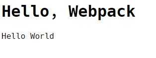
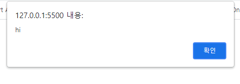

웹사이트를 만들다보면 js css image 수많은 파일들이 생겨나는데

완성된 웹사이트를 로딩해보면 개많은 파일들이 다운로드 된다는 것을 볼 수 있다.

이는 서버와의 접속이 많아져서 속도에 문제를 발생시킨다.

또 여러 패키지들을 사용하다보면 서로의 변수들이 겹치는 등 예상치 않은 문제들이 또 발생한다.

이런 문제를 해결하기 위해 등장한 것이 Bundler이다.

Bundler는 여러 파일을 묶어주는 것인데,

##### WebPack

Broserify

Parcel

이런 것들이 Bundler 도구인 것이다.

그 중 가장 인기있는 것이 WebPack이고 이것에 대해 학습해보려고 한다.

WebPack을 이용하면 js, css, image 등 여러 모듈들을 몰아 넣을 수 있고 분리할 수 있다.


## 모듈

```html
// index.html
...
<script src="./source/hello.js"></script>
<script src="./source/world.js"></script>
</head>
<body>
    <h1>Hello, Webpack</h1>
    <div id="root"></div>
    <script>
        document.querySelector('#root').innerHtml = word
    </script>
```

```js
// source/hello.js

let word = 'Hello';
```

```js
// source/world.js

let word = 'World';
```

뭐 이런 식으로 폴더구조를 잡았다고 해보자.

그러면 html 파일에서 id가 root인 태그의 innerHtml을 word 변수로 주고있는데 어떻게 적용될까?


이렇게 나온다.

즉, word 변수가 겹치게 되어서 둘 중 하나만 변수값에 할당되어 나오는 것이다.


이번에는 이렇게 해보겠다.

```html
// index.html
...
</head>
<body>
    <h1>Hello, Webpack</h1>
    <div id="root"></div>
    <script type="module">
        import hello_word from "./source/hello.js";
        import world_word from "./source/world.js";
        document.querySelector('#root').innerHtml = hello_word + ' ' + world_word;
    </script>
```

```js
// source/hello.js

let word = 'Hello';

export default word
```

```js
// source/world.js

let word = 'World';

export default word
```

이렇게 하게 되면 결과 화면이



이렇게 된다.

모듈이란 파일 하나를 뜻한다. application을 개발하면서 코드가 길어지면 언젠간 파일을 분리해야하는데, 이때 분리한 파일을 모듈이라고 부르고 모듈들을 사용하고자 하는 파일에서 불러와 사용할 수 있다.

모듈은 특수한 지시자 `export`와 `import`를 사용하여 각 모듈에 있는 변수 및 함수, 클래스 들을 import하여 사용할 수 있다.

이때 모듈은 특수한 키워드나 기능과 함께 사용되므로 <script type="module"> 같은 속성을 설정해 해당 스크립트가 모듈이란걸 브라우저가 알 수 있게 해주어야한다.


😃 모듈 & 일반 스크립트의 차이점

모듈은 독립된 스코프를 갖는다.

무슨말이냐면

```html
// index.html

...
<script src="source/test1.js"></script>
<script src="source/test2.js"></script>
```

```js
// source/test1.js
let msg = 'hi';
```

```js
// source/test2.js
alert(msg);
```

이렇게 파일을 만들어주고 실행시키면



이렇게 alert창이 잘 뜬다.

즉, msg라는 변수를 서로 공유하여 사용한다는 것이다.

하지만,

```js
// index.html

...
<script type="module" src="source/test1.js"></script>
<script type="module" src="source/test2.js"></script>
```

이렇게 index파일을 고치고 실행시켜보면


이렇게 msg가 정의되어 있지 않다는 에러메세지가 나오게 된다.

한마디로 모듈은 각각 독립적인 스코프가 있으며, 모듈 내부에서 정의한 변수나 함수는 다른 스크립트에서 접근할 수 없게 되는 것이다.

이로써 만일 여러 파일에서 같인 이름의 변수를 사용하더라도 독립적인 공간으로 되어버리는 격이니까 걱정할 필요가 없어진 것이다.


이렇게 모듈이라는 것에 대해서 알아보았고

브라우저에서 웹 페이지를 열 때 모듈들을 다운로드 받아서 실행시고 웹 화면을 띄우게 되는데,

위 에서는 모듈을 2개만 사용하였지만, 만일 수백 수천개의 모듈(js, css ,img 등)이 존재한다고 한다면 굉장히 과부하가 걸리고 속도에서도 문제가 생길 것이다.

사용자 입장에서는 서비스의 경험이 떨어지고, 서비스 제공자 입장에서는 컴퓨터의 자원이 많이 사용되기 때문에 비용이 더 많이 들게 된다.

그래서, Web에서도 여러 파일을 하나의 파일로 묶어서 제공하고자 만든 도구가 Bundler인것이다.

그중 가장 보편적으로 사용되는 Webpack을 공부해보자.