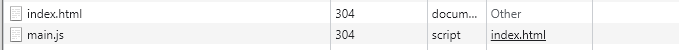

웹팩을 사용하기 위해선 node.js를 사용해야한다.

그리고 

```
$ npm init
```

으로 현재 디렉토리를 node.js의 프로젝트 폴더로 만들어준다.

그러면 package.json이라는 파일이 생성이 되는데

이 상태에서 웹팩을 설치한다

```bash
$ npm install -D webpack webpack-cli
```

> webpack, webpack-cli 2개 설치, -D는 개발 전용

설치한뒤 package.json에 webpack와 webpack-cli가 추가된 것을 볼 수 있다.

이제 이전에 작성했던 index.html 파일에서

```html
// index.html
...
</head>
<body>
    <h1>Hello, Webpack</h1>
    <div id="root"></div>
    <script type="module">
        import hello_word from "./source/hello.js";
        import world_word from "./source/world.js";
        document.querySelector('#root').innerHtml = hello_word + ' ' + world_word;
    </script>
```

import부분을 따로 source/index.js 파일로 빼는 작업을 해준다.

그러면 작업 결과물은 아래와 같다.

```html
// index.html
...
</head>
<body>
    <h1>Hello, Webpack</h1>
    <div id="root"></div>
```

```js
// source/index.js
import hello_word from "./hello.js";
import world_word from "./world.js";
document.querySelector('#root').innerHtml = hello_word + ' ' + world_word;
```

> 이때 경로가 바뀌었으므로 상대경로 수정
>
> index.js 파일은 hello.js와 world.js를 사용하고 있기 때문에 **엔트리 파일**이 된다.

이제 사용되고 있는 각 모듈들을 번들링을 해보자.

public이라는 폴더 안에 해보겠다.

```bash
$ npx webpack --entry ./source/index.js --output-path ./public
```

> webpack 명령을 할땐 앞에 npx webpack 붙여준다.

이렇게 해주면 public이라는 폴더 안에 main.js라는 번들링된 파일이 하나 생긴다.


이렇게 번들링을 하고 main.js 파일을 열어보면

```js
(()=>{"use strict";document.querySelector("#root").innerHTML="Hello World"})();
```

이렇게 되있었다.

hello.js와 world.js에서 각각의 Hello와 World가 합쳐져 있는 것을 확인해 볼 수 있다.

이제 마지막으로 index.html에서 번들링한 모듈을 불러와서 사용한다.

```html
// index.html
...
</head>
<body>
    <h1>Hello, Webpack</h1>
    <div id="root"></div>
    <script src='./public/main.js'></script>
```


이렇게 한 뒤 작업 결과물을 보면


이전과 똑같다.

하지만 네트워크 탭을 열어보면



이렇게 번들링된 모듈만 가져온다.

여러 모듈을 가져오는 것보다 훨씬 효율적이다.

또한 번들링을 통해서 최신 버전에서만 사용가능한 코드를 예전 브라우저 버전에서도 사용될 수 있도록 해준다.
(예를 들어 import, export 같은 것들)