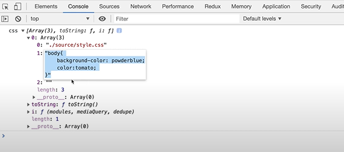
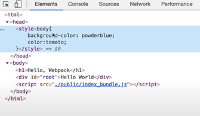
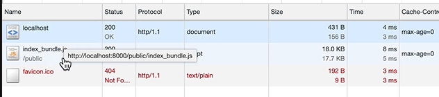

# Loader

> webpack은 기본적으로 Javascript 파일밖의 로드하지 못하지만, 이 loader를 사용하여 여러 타입의 파일들을 Javascript에서 바로 사용가능할 수 있는 형태로 만든다.


html에 css를 style태그로 넣어주면 웹브라우저에서 css파일을 다운로드 받아온다.

이걸 webpack을 사용하여 하나의 js파일에서 다 가져올 수 있도록 loader를 사용해보자.


Loader는 모듈을 입력받아 원하는 형태로 변환한 후 새로운 모듈을 출력해준다. 설정에서 옵션의 속성으로 관리할 수 있는 Loader는 바벨같은 트랜스파일러 뿐 아니라 이미지파일, CSS파일 등에 대해서도 작업을 할 수 있다.


일단 기본적으로 css파일을 하나 만든다.

```css
/* source/style.css */

body {
    background-color: powderblue;
    color: tomato;
}
```


그리고 이제 이 css파일을 js파일에 import하여 의존성을 주입해준다.

```js
// source/index.js

// entry 파일
import hello_word from "./hello.js";
import world_word from "./world.js";
import css from "./style.css";
document.querySelector("#root").innerHTML = hello_word + " " + world_word;

```


다음으로 webpack.config.js에서 설정을 해준다.

설정을 해주기 전에 loader들을 설치해야한다. (style-loader와 css-loader를 설치해준다.)

```bash
$ npm install --save-dev style-loader css-loader
```

그리고 webpack.config.js에 설정을 해준다.

```js
const path = require("path");

module.exports = {
  mode: "development",
  entry: "./source/index.js",
  output: {
    // __dirname: 현재 webpack.config.js파일이 있는 경로
    // 그 안에 public라는 하위 경로를 만들어서 output 경로를 설정
    path: path.resolve(__dirname, "public"),
    filename: "main.js",
  },
  module: {
    rules: [
      {
        test: /\.css$/,
        use: ["style-loader", "css-loader"],
      },
    ],
  },
};
```

> rules 속성에 test에는 정규표현식으로 확장자가 css파일임을 알려주고
>
> use에는 사용되는 loader들을 입력해준다. 이때 use 속성에 배열을 입력하면 오른쪽 항목부터 먼저 실행이 된다.
> 즉, .css확장자에 css-loader와 style-loader를 순서대로 사용하라는 것이다.


설정을 끝냈으면 `npx webpack`으로 번들링을 해준다.

그러면,

css-loader가 먼저 CSS데이터를 생성한다. (이렇게 하면 js에 css속성이 자바스크립트 형태로 들어간다.)



그런 뒤 style-loader가 HTML head에 style 태그를 삽입해준다.



그리고 



초기의 목적인 css파일은 다운로드 받지 않고 번들링된 파일 하나로 불러오게 된다.


css loader와 style loader 추가학습

#### ✨ css-loader

css파일을 자바스크립트에서 불러와 사용하려면 css를 모듈로 변환하는 작업이 필요하다. `css-loader`가 그런 역할으 하는데 코드에서 css파일을 모듈처럼 불러와 사용할 수 있게끔 해준다.


#### ✨ style-loader

모듈로 변경된 스타일 시트는 DOM에 추가되어야만 브라우져가 해석할 수 있다. css-loader로 처리하면 자바스크립트 코드로만 변경되었을 뿐 DOM에 적용되지 않았기 대문에 스타일이 적용되지 않는다.

`style-loader`는 자바스크립트로 변경된 스타일을 동적으로 DOM에 추가하는 로더이다. css를 번들링하기 위해서는 css-loader와 style-loader를 함께 사용한다.