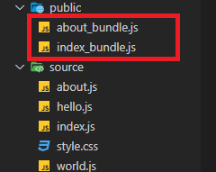

# output 설정

> output은 웹팩이 어디에 번들을 만들어 낼 것인지, 어떤 이름으로 파일들을 어떻게 만들 것인지를 처리해준다.
>
> output을 알맞게 변경시켜줌으로써 경로와 파일이름을 정해줄 수 있다.


이전 글까지는 output 설정을 하나로만 해서 entry파일 하나를 번들링했는데

하다보면 entry파일을 여러개 만들 때도 있을 것이다.

그러면 그럴때 entry를 번들링한 output파일을 여러개 만들 필요가 있는데

webpack.config.js에 몇 설정이 필요하다.


```html
//index.html

...
  <h1>Hello, Index</h1>
  <div id="root"></div>
  <a href="./about.html">about</a>
  <script src="public/index_bundle.js"></script>
...
```


```html
// about.html

...
  <h1>Hello, About</h1>
  <div id="root"></div>
  <a href="./index.html">index</a>
  <script src="public/about_bundle.js"></script>
...
```

index.html 파일 외에 about.html을 하나 더 만들어준다.

public/about_bundle.js는 아직 안만들었는데 일단 번들링 후 어짜피 작성해줘야 하므로 미리 코드를 작성해놓았다.


```js
// source/about.js

// entry 파일
import hello_word from "./hello.js";
import world_word from "./world.js";
import css from "./style.css";
document.querySelector("#root").innerHTML = world_word + " " + hello_word;

```

그리고 about.js라는 entry파일을 하나 만든다.

이제 webpack.config.js를 설정해주면 되는데,

```js
module.exports = {
  mode: "development",
  entry: {
    index: "./source/index.js",
    about: "./source/about.js",
  },
  output: {
    // __dirname: 현재 webpack.config.js파일이 있는 경로
    // 그 안에 public라는 하위 경로를 만들어서 output 경로를 설정
    path: path.resolve(__dirname, "public"),
    filename: "[name]_bundle.js",
  },...
```

이렇게 설정을 해준다.

entry 속성에 이름과 경로를 적어주고

output 속성에 `[name]` 이렇게 해주고

npx webpack하면

 설정한 각각의 이름으로 bundle파일이 만들어진다.




#### ✨ Multiple Entry Points

설정에서 하나 이상의 "청크"를 생성하면(다중 엔트리 포인트나 CommonsChunkPlugin과 같은 플러그인을 사용하는 경우) [substitution](https://webpack.kr/configuration/output/#outputfilename)을 사용하여 파일이 고유한 이름을 갖도록 해야 합니다.

```js
module.exports = {
  entry: {
    app: './src/app.js',
    search: './src/search.js',
  },
  output: {
    filename: '[name].js',
    path: __dirname + '/dist',
  },
};
```

